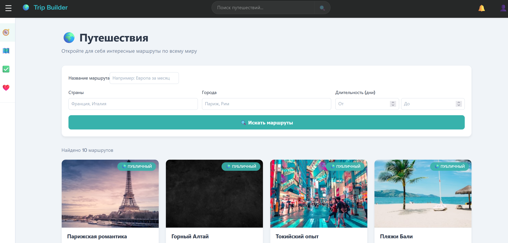
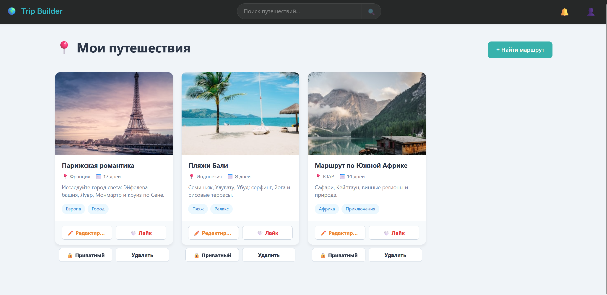
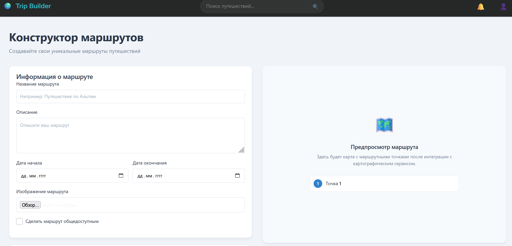
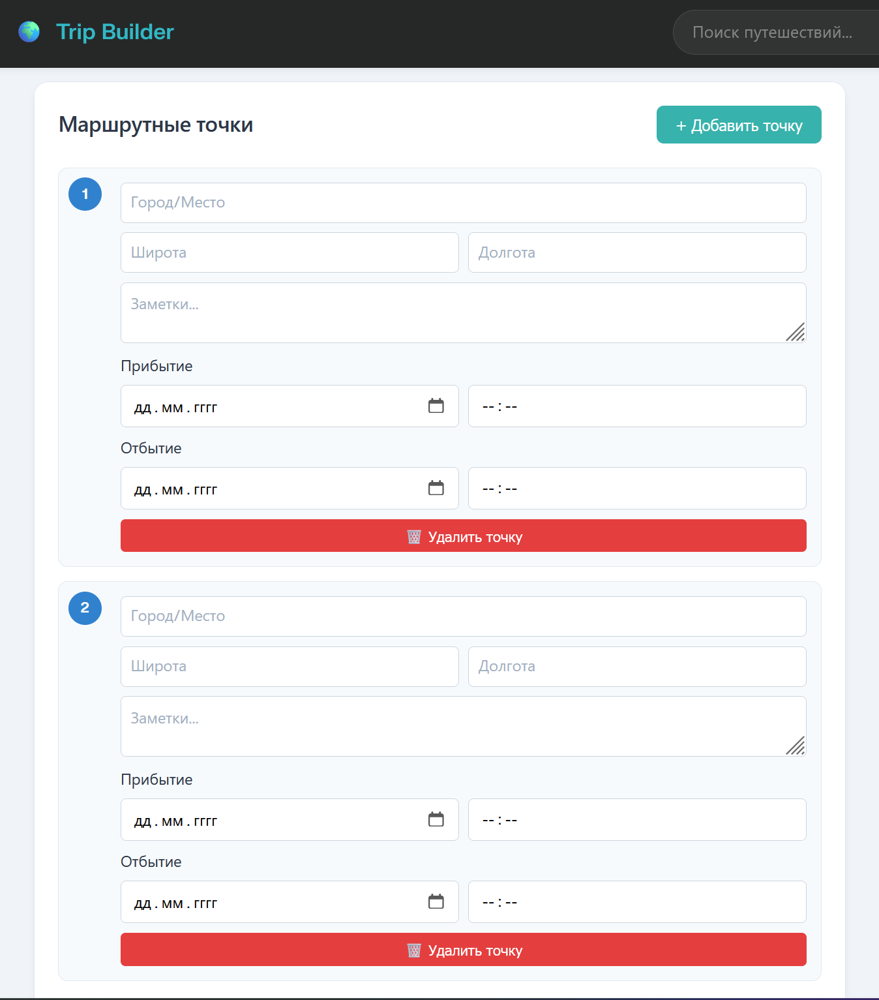
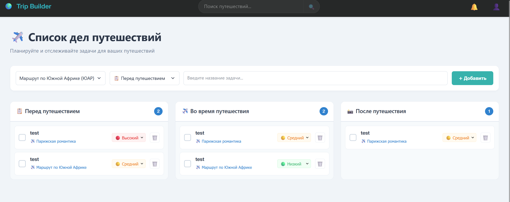
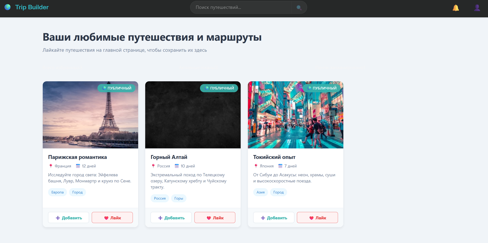
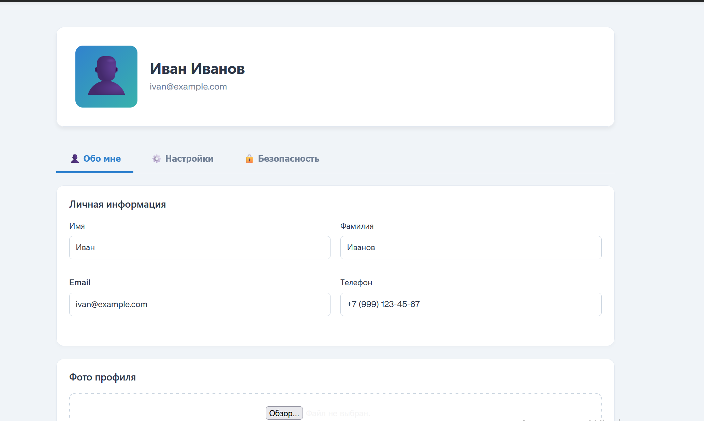
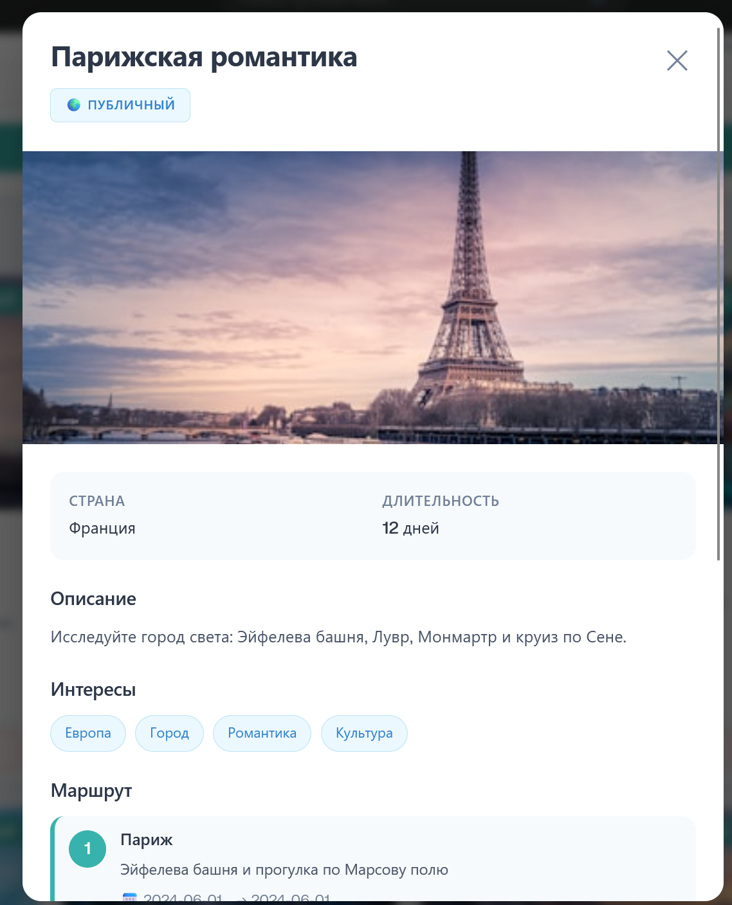

# 📊 Trip Builder - Презентация продукта

## 🎬 Титульный лист

# 🌍 Trip Builder
## Конструктор путешествий

**Веб-приложение для создания, планирования и обмена путешествиями**

- 👨‍💻 **Разработчик**: Денис Туев
- 🎓 **Учебное заведение**: РТУ МИРЭА
- 📅 **Дата**: Декабрь 2025
- 🔗 **Репозиторий**: https://github.com/Sun1tAr/MIREA-TripBuilder-FrontEnd
- 🌐 **Demo**: http://denchik2376.fvds.ru/MIREA-TripBuilder-FrontEnd/

---

## 📖 Описание проекта

### Проблема

Планирование путешествия — сложный процесс, который требует:
- Поиска интересных маршрутов
- Организации маршрутных точек
- Управления списком дел и задач
- Сохранения понравившихся маршрутов
- Обмена идеями с другими путешественниками

### Решение

**Trip Builder** — комплексное веб-приложение, которое объединяет все необходимые функции в один удобный интерфейс:

✅ Создание и управление маршрутами  
✅ Просмотр каталога путешествий  
✅ Управление списком дел  
✅ Сохранение избранных маршрутов  
✅ Обмен путешествиями с сообществом  

---

## 🎯 Основные возможности

### 1️⃣ Каталог путешествий (Home Page)



**Функционал:**
- Просмотр всех доступных путешествий в виде красивых карточек
- Информация о каждом маршруте: название, страна, длительность
- Поиск по названиям путешествий
- Просмотр подробной информации в модальном окне
- Добавление в избранное одним кликом
- Информация о том, кто создал маршрут (публичный или личный)

---

### 2️⃣ Мои путешествия (My Trips Page)



**Функционал:**
- Список всех путешествий текущего пользователя
- Редактирование существующих маршрутов
- Просмотр подробной информации о своих путешествиях
- Удаление путешествий
- Быстрый доступ к каждому маршруту

---

### 3️⃣ Конструктор маршрутов (Constructor Page)



**Функционал:**
- Создание новых путешествий с нуля
- Заполнение основной информации:
  - 📍 Название путешествия
  - 🌍 Страна назначения
  - ⏱️ Длительность путешествия
  - 🖼️ Загрузка изображения
  - 📝 Подробное описание

**Добавление маршрутных точек:**
- Интерактивное добавление остановок в путешествии
- Для каждой точки: город, описание, даты посещения
- Визуальный предпросмотр маршрута на карте
- Возможность удаления и изменения порядка точек

**Метаданные:**
- 🏷️ Добавление тегов (интересы, тип путешествия)
- 🔓 Выбор типа маршрута (публичный/личный)
- 💾 Автосохранение в черновики



---

### 4️⃣ Список дел (Todo List Page)



**Функционал:**
- Создание новых задач с описанием
- Привязка задачи к конкретному путешествию
- Установка приоритета (высокий 🔴, средний 🟠, низкий 🟢)
- Отметка выполненных задач ✅
- Удаление задач
- Просмотр задач по путешествиям

**Визуализация:**
- Карточки задач с цветовым кодированием приоритета
- Интерактивное переключение статуса
- Быстрый доступ к путешествию из задачи

---

### 5️⃣ Избранное (Favorites Page)



**Функционал:**
- Коллекция добавленных в избранное путешествий
- Быстрый доступ к понравившимся маршрутам
- Удаление из избранного
- Просмотр полной информации о маршруте

---

### 6️⃣ Профиль пользователя (Profile Page)



**Функционал:**
- Просмотр информации о профиле
- Редактирование личных данных
- История всех созданных путешествий
- Статистика путешественника
- Управление публичными маршрутами

---

### 7️⃣ Модальное окно путешествия



**Функционал:**
- Полная информация о путешествии
- Большое изображение маршрута
- Все маршрутные точки с датами
- Список тегов и интересов
- Информация о создателе
- Кнопки действия: редактировать или добавить маршрут

---

## 🛠️ Технологический стек

### Frontend Framework
- **React 19.2** — современный UI фреймворк с компонентной архитектурой
- **React Router 7.9** — клиентская маршрутизация и навигация между страницами
- **Vite 7.2** — быстрая сборка приложения с HMR

### Управление состоянием
- **Context API** — глобальное состояние приложения
  - `AuthContext` — данные пользователя и аутентификация
  - `TripsContext` — управление путешествиями
  - `TasksContext` — управление задачами
  - `UIContext` — состояние интерфейса (модали, меню)

### Хранение данных
- **Local Storage** — сохранение данных на клиенте
  - Путешествия
  - Задачи
  - Избранные маршруты
  - Информация пользователя

### Стилизация
- **CSS 3** — модульные стили для компонентов
- **Flexbox & Grid** — адаптивная вёрстка
- **Media Queries** — оптимизация для всех устройств

### Развёртывание
- **Docker** — контейнеризация приложения
- **Nginx** — веб-сервер для production
- **GitHub** — версионирование и хостинг

---

## 🎨 Дизайн и интерфейс

### Цветовая палитра
- **Primary (Teal)**: #38B2AC — основные действия и выделения
- **Secondary (Orange)**: #ED8936 — редактирование и вторичные действия
- **Danger (Red)**: #E53E3E — удаление и опасные операции
- **Success (Green)**: #48BB78 — успешные операции
- **Background**: #F0F4F8 — фон приложения

### Компоненты UI

**Button**
- Варианты: primary, secondary, outline, ghost, danger
- Размеры: sm, md, lg
- Состояния: normal, hover, active, disabled
- Поддержка иконок и текста

**Input Field**
- Валидация с сообщениями об ошибках
- Placeholder текст
- Disabled состояние
- Поддержка разных типов (text, email, number, date)

**TaskCard**
- Чекбокс для отметки выполнения
- Приоритет задачи с выбором
- Информация о путешествии
- Кнопки удаления и восстановления

**TripCard**
- Изображение путешествия
- Информация: название, страна, длительность
- Теги и описание
- Кнопки: редактировать, добавить, лайк

**TripModal**
- Полная информация о путешествии
- Список маршрутных точек
- Информация о статусе (мой/публичный)
- Кнопки действия


---

## 📱 Адаптивность

### Поддерживаемые устройства

**🖥️ Desktop (1024px+)**
- Полный функционал и видимость всех элементов
- Развёрнутая навигация
- Оптимальное отображение на больших экранах

**📱 Tablet (768px+)**
- Адаптированная раскладка для среднего экрана
- Сворачиваемая боковая панель
- Оптимизированные кнопки и формы

**📱 Mobile (480px+)**
- Минимальный интерфейс для малых экранов
- Полностью мобильный layout
- Touch-friendly кнопки и элементы
- Вертикальная прокрутка


---

## 🏗️ Архитектура приложения

### Структура папок

```
src/
├── components/          # React компоненты
│   ├── Common/         # Переиспользуемые компоненты
│   ├── Layout/         # Layout компоненты (Header, Sidebar, Footer)
│   └── Trip/           # Специфичные компоненты путешествий
├── pages/              # Страницы приложения
├── context/            # Context провайдеры для состояния
├── utils/              # Утилиты и хелперы
├── theme/              # Глобальные стили
└── App.jsx             # Главный компонент
```

### Поток данных

1. **Пользователь** взаимодействует с интерфейсом
2. **Компонент** отправляет действие через handler
3. **Context** обновляет глобальное состояние
4. **Local Storage** сохраняет изменения
5. **Компоненты** перерендерятся с новыми данными

---

## 🚀 Развёртывание

### Локальная разработка

```bash
npm run dev          # Запуск на http://localhost:5173
```

### Production в Docker

```bash
docker build -f .docker/Dockerfile -t trip-builder .
docker run -d -p 3000:80 trip-builder
```

### Автоматическое обновление

```bash
bash ./update.sh     # Pull + Build + Restart
```

---

## 📊 Используемые данные

### Путешествие (Trip)
```javascript
{
  id: "123",
  title: "Римские каникулы",
  country: "Италия",
  duration: "6 дней",
  description: "Путешествие по древним достопримечательностям...",
  image: "https://...",
  tags: ["история", "культура", "архитектура"],
  waypoints: [
    { city: "Рим", description: "Колизей и Ватикан", startDate: "01.01" }
  ],
  isPublic: true,
  liked: false,
  createdBy: "user123"
}
```

### Задача (Task)
```javascript
{
  id: "456",
  title: "Купить билет в музей",
  description: "Забронировать билет в Ватиканский музей",
  tripId: "123",
  tripName: "Римские каникулы",
  priority: "high",
  completed: false,
  createdBy: "user123"
}
```

---

## 🌟 Ключевые особенности

### ✨ Простота использования
- Интуитивный интерфейс
- Минимум кликов для основных действий
- Понятная иерархия информации

### 🎯 Функциональность
- Полный цикл управления путешествиями
- Интеграция с управлением задачами
- Система избранного

### 🔒 Безопасность
- Валидация входных данных
- Защита маршрутов по авторству
- Безопасное хранение в Local Storage

### ⚡ Производительность
- Быстрая сборка на Vite
- Оптимизированный рендеринг React
- Адаптивная вёрстка без задержек

### 📱 Мобильность
- Полная поддержка мобильных устройств
- Touch-friendly интерфейс
- Оптимизация для разных размеров экранов


---

## 💡 Инновационные решения

### 1. Двойное использование контекста для управления состоянием
- Эффективное распределение ответственности между контекстами
- Чистая архитектура компонентов
- Легко масштабируемая структура

### 2. Modal-based просмотр путешествий
- Не требует отдельной страницы
- Быстрый просмотр информации
- Лучший UX при обзоре каталога

### 3. Интегрированное управление задачами
- Связь задач с путешествиями
- Единое место для всех забот
- Улучшенное планирование

### 4. Адаптивный дизайн на CSS
- Без зависимостей от UI библиотек
- Полный контроль над стилями
- Лёгкий в поддержке код

---

## 🧪 Тестирование

### Функциональное тестирование

✅ Создание путешествия с маршрутными точками  
✅ Редактирование существующего маршрута  
✅ Поиск по каталогу путешествий  
✅ Добавление/удаление из избранного  
✅ Создание и управление задачами  
✅ Фильтрация по приоритету  

### Тестирование адаптивности

✅ Desktop (1920px, 1366px)  
✅ Tablet (768px, 1024px)  
✅ Mobile (375px, 480px)  

### Браузеры

✅ Chrome (последняя версия)  
✅ Firefox (последняя версия)  
✅ Safari (последняя версия)  
✅ Edge (последняя версия)  

---

## 🔧 Технический стек в деталях

### React & Ecosystem
- React 19.2 с новыми features
- React Router для SPA маршрутизации
- Lucide React для иконок (не использовано, но готово)

### Сборка & Development
- Vite для быстрой разработки
- ESLint для проверки качества кода
- CSS Modules для изоляции стилей

### Deployment & DevOps
- Docker для контейнеризации
- Nginx как reverse proxy
- Скрипт автоматического обновления

---

## 📞 Информация о разработчике

**Денис Туев**
- 👨‍💻 Frontend разработчик
- 📧 Email: sun1tar@yandex.com
- 🐙 GitHub: [@Sun1tAr](https://github.com/Sun1tAr)
- 💬 Telegram: @Sun1tAr

---

## 📚 Заключение

**Trip Builder** — это полнофункциональное веб-приложение для планирования путешествий, которое демонстрирует:

✅ Глубокое понимание React и архитектуры приложений  
✅ Навыки в создании адаптивных интерфейсов  
✅ Опыт работы с управлением состоянием  
✅ Внимание к UX/UI и деталям дизайна  
✅ Умение решать сложные проблемы планирования  

Приложение готово к использованию и масштабированию, имеет четкую архитектуру и документацию для будущего расширения функционала.

---

**Спасибо за внимание!** 🎉

